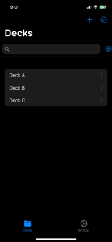
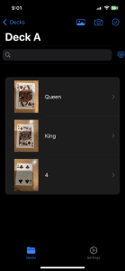
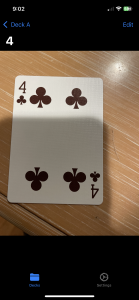
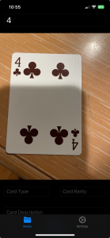
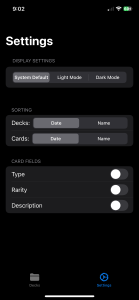

# Virtual Deck

[Demo Video](./demo/videoA.mp4)

## What is Virtual Deck?
Virtual Deck is an iOS app designed for card game enthusiasts to store, organize, and manage their card collections virtually. Users can create decks, add or edit cards, and customize their collections with details like descriptions, rarity, and type. The app also supports importing decks, locking decks to prevent accidental deletion, and zooming in on card images for better visibility.

## Why Was It Made?
This app was developed as the final project for my mobile app development course. I wanted to create a tool that fills a gap in the market for virtual deck management while showcasing the skills I learned in iOS development.

---

## Key Features
- **Deck Creation and Management:**
  - Create, edit, and delete decks.
  - Lock decks to prevent accidental deletion.
- **Card Customization:**
  - Add, remove, and edit cards within decks.
  - Add details like **description**, **rarity**, and **type** to each card.
- **Importing Decks:**
  - Import decks from external sources for easy setup.
- **Image Zooming:**
  - Double tap on an image to zoom in on card images for a closer look.
- **User-Friendly Interface:**
  - Intuitive design for seamless navigation and organization.

---

## Key Takeaways
- **App Development:** Gained hands-on experience in iOS app development using **Swift**.
- **UI/UX Design:** Learned to design intuitive and user-friendly interfaces.
- **Data Management:** Implemented core data or similar frameworks to manage decks and cards efficiently.
- **Problem Solving:** Overcame challenges in implementing features like deck locking and image zooming.

